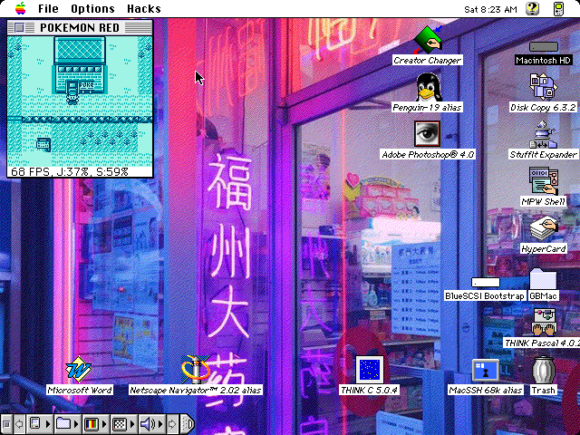
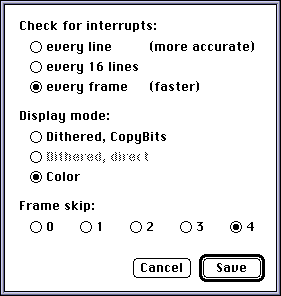
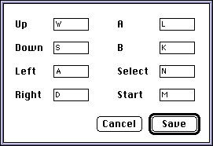

#  gb6 - Game Boy emulator for Macintosh System 6

gb6 is a Game Boy emulator targeting 68k Macintosh with a focus on execution speed.
The emulator features a JIT compiler that translates Game Boy code into 68k code
for maximum speed.

This project does not make any attempt to be particularly accurate to the GB
hardware - I had to make too many compromises in order to get it working at all.
Despite this, many games work well and run fast enough to be enjoyable.

I have tested this on a Mac Plus with System 6.0.8, a Mac SE/30 with 7.1, and a
Mac IIfx with 7.5.3. A mid-range 68030 can get around 30 FPS with no sound and
frame skip, and a fast 68030 or 68040 can achieve real-time speeds with sound
enabled (and frame skip still on), depending on video settings. Original 8 MHz
68000 Macs get around 5 FPS :( but this is still better than my original
interpreter version which completed one frame every 5-6 seconds.

My goal with this project was to give vintage Mac enthusiasts another fun app
to check out.



## System requirements

* Any 68k Macintosh (68030+ highly recommended)
* Some amount of RAM (see below)
* System 6.0.5 and up

This is a memory-intensive application, and the amount of memory required depends
on how big the games you want to play are. The simplest games require around 
2 MB, with larger games like Pokémon requiring 16 MB for the best performance.

If the emulator runs out of RAM, it will clear all compiled code and try again.
Since each code path is only compiled as it is reached, this gives things like
copyright screens, intro sequences, decompression code, etc. a chance to be
evicted.

If the "working set" of the game exceeds the available RAM, the emulator will
get into a loop of compiling -> clearing -> compiling -> clearing. If this
happens, you can hopefully just quit - I've taken care to ensure it doesn't
crash in this scenario.

Since this emulator translates Game Boy code into 68000 code and then executes
that code directly, anything that would crash the original game, including bugs
in my program, will crash your Mac! So I highly recommend having no other
applications open when using the emulator.

## Releases

Releases are available in the GitHub releases tab in MacBinary format.
Download the app, copy it somewhere on your machine, and run it.
You'll be asked to choose a .gb file (after you open it once, if it has a 
battery save it will be created and the type/creator codes will be set
so you can open it easily again!)

### Default key mappings

WASD for D-pad, L for A, K for B, M for Start, N for Select. Feel free to
customize in the Key Mappings dialog.

## Compatibility

### Games

| Game | Status |
| - | - |
| Tetris | Works |
| Dr. Mario | Works |
| Pokémon Red/Blue | Works |
| Pokémon Gold/Silver | Works (DMG mode) |
| Link's Awakening | Works |
| Link's Awakening DX | Works (DMG mode) |
| Super Mario Land | Works |
| Super Mario Land 2 | Crashes |
| Everything else | No idea |

If you try a game, please report whether it works (playable/unplayable but no
crash/crashes the Mac).
If it does NOT work, open an issue and I'll decide whether to fix it based on
how difficult it is to fix :)

### Memory bank controllers

MBCs 1-5 are all supported, including battery saves. Saves are stored in files
matching the internal ROM name (for example, "ZELDA" for Link's Awakening).

## Limitations

* Audio sounds like crap on System 6
  - If anyone knows how to use `SndPlayDoubleBuffer()` on System 6 and not
    have a ton of popping noises, let me know
  - Chances are if your machine is fast enough to try audio you're on System 7
    anyway
* Memory management could be better
  - Clear unused blocks instead of everything
* LCD rendering is... yeah (see below)

## Preferences

 

### Background info on rendering

A real Game Boy is constantly visiting each pixel on the screen, reading the
state of video RAM and hardware registers at the moment that pixel is reached,
and using this information to decide what color it should be. When the bottom
of the screen is reached, there is a short period of time where the program can
transfer new image data to video RAM and move sprites around before the drawing
process starts again. When this period starts, the program is interrupted
and the CPU jumps to an interrupt handler where it makes its updates.

This process is prohibitively slow on a 68k Mac, so instead, the entire LCD is
rendered all at once based on how the registers are set either at the halfway
point (Y=72) or the bottom (Y=144) of the screen, depending on how the "check for
interrupts" preference is set and whether or not the game uses the HALT instruction.

### Check for interrupts

This preference controls how often the emulator exits compiled code and checks for
interrupts. Three options are available to choose from depending on the speed of
your Mac: every line (most CPU intensive), every 16 lines, and every frame
(fastest). "Every frame" is usually good enough for RPGs, while platform games
with status bars usually need "every 16 lines". I haven't found any games that
would both require "every line" and don't just crash the emulator 🙃 but it's
there just in case.

Checking more frequently than every frame enables the emulator to draw the LCD
at its midpoint, which has the best chance of avoiding glitches due to status
bars at the top or bottom.

#### HALT

The HALT instruction stops execution of the program until an interrupt is
received. On a real Game Boy, this conserves battery. In the emulator, this
enables "advancing time" to the next interrupt, which avoids busy waiting and
leaves more Mac CPU time for drawing the screen. 

This interacts with the "check for interrupts" preference in an interesting way. Since
HALT skips directly to the next interrupt (bottom of the screen), interrupts are
checked according to the setting until a HALT is reached, at which point they
won't be checked again until the bottom. This causes rendering to happen at the
bottom of the screen instead of the middle.

### Display mode

This preference allows you to choose how the Game Boy screen is displayed on your
monitor. The dithered options use ordered dithering patterns to draw the screen
in black-and-white at 2x scale, while the color option uses a nice palette
(which will be configurable in the future?)

* **Dithered (CopyBits)** uses the `CopyBits()` QuickDraw function to copy the image
  data to your Mac's video RAM.
* **Dithered (direct)** writes video RAM directly. In my experiments, this is faster
  on B&W Macs, but actually slower on Macs with more advanced video hardware.
  Don't move the window offscreen when using this option... there are currently
  no checks on writing out-of-bounds. This option is unavailable when your display
  is set to color.
* **Color** uses Color QuickDraw. This option is unavailable on B&W Macs
  and when your color display is set to B&W.

### Frame skip

Copying the Game Boy pixels to your Mac's screen is a pretty expensive operation.
This preference allows one in every 2, 3, 4, or 5 frames to actually be drawn
to the screen. Skipped frames are still emulated - only the actual drawing is
skipped. This can drastically increase performance on slow machines.

## Hacks

### Force draw sprites

Turn this on if sprites are invisible when they should be visible.

Developers can configure the Game Boy to fire an interrupt whenever a certain
Y coordinate is reached when rendering. Games use this to modify scrolling
mid-frame, create visual effects, or hide sprites on top of text boxes, status
bars, etc.

In the emulator, this interrupt is useless because of the per-frame rendering
strategy, and in fact annoying because games can disable sprites and leave them
disabled for the time when the screen is drawn. "Force draw sprites" makes
the emulator render sprites even if they're turned off on the Game Boy side.

## Building

This project uses the Retro68 GCC port. Do this:

```
#!/bin/sh
mkdir -p build
cd build
cmake .. -DCMAKE_TOOLCHAIN_FILE=../../Retro68-build/toolchain/m68k-apple-macos/cmake/retro68.toolchain.cmake
make
cd ..
```

...replacing the path to `CMAKE_TOOLCHAIN_FILE` with wherever you have it installed.
Or run `system6/compile.sh` which contains exactly that code.

## Project structure

Here are some interesting files:

* `system6/`
  - `emulator.c` - entry point, event handling, offscreen buffer setup
  - `jit.c` - JIT context setup, calls into compiler, glue code for generated
    machine code
  - `dispatcher_asm.c` - machine language routines for chaining between blocks
    and patching blocks to jump directly to the next one
  - `lcd_mac.c` - output functions for B&W and color monitors
  - `audio_mac.c` - hooks up GB audio driver to the Sound Manager
  - `dialogs.c` - open dialog, preferences dialog, key mappings dialog, alert dialogs

* `src/`
  - `dmg.c` - memory read/write functions, general "sync hardware" function
  - `lcd.c` - background and sprite rendering
  - `mbc.c` - memory bank controllers
  - `audio.c` - audio driver

* `compiler/`
  - `compiler.c` - entry point

The separation between `src/` and `system6/` is largely a carryover from when
I had an ImGui debug version that ran on modern OSes while developing the
interpreter version of the emulator.

## LLM statement

I used Claude Code to generate compiler tests, quickly generate 68k instruction
emitter functions, and heavily comment my emitted instruction sequences with
the corresponding assembly syntax and offsets, because they're confusing.

## License

GNU GPL version 3.
